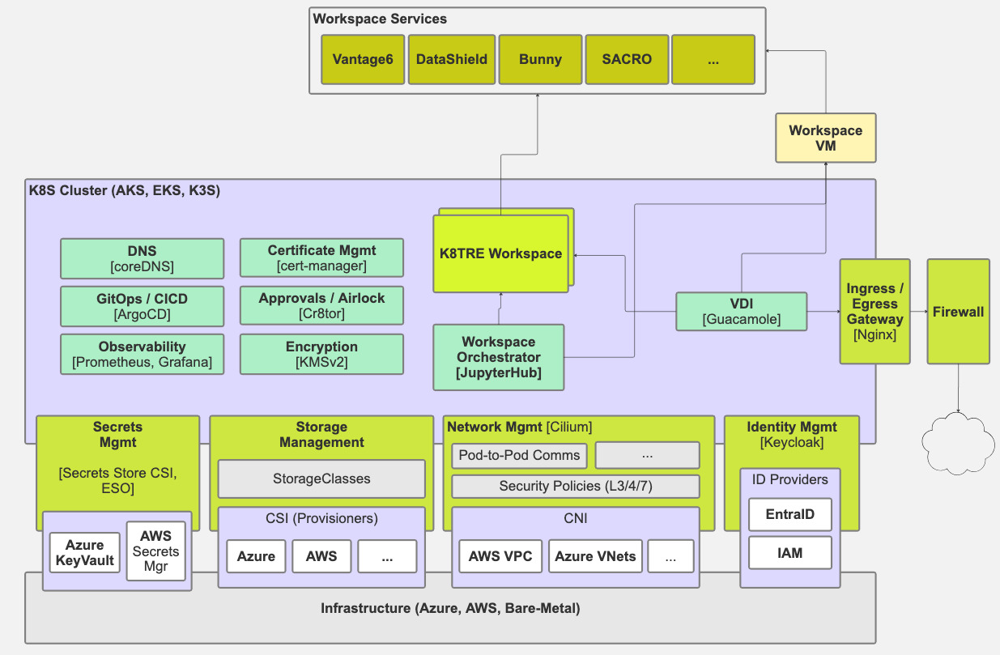

# K8TRE Architecture

## How the K8TRE Reference Implementation meets the K8TRE Specification

### BYO Software

### Container Runtimes

The K8TRE Reference Implementation uses the default high- and low-level container runtimes in the EKS, AKS, K3S Kubernetes distributions. 

### Databases

The K8TRE Reference Implementation includes the CNPG operator and a default Postgres database. Applications can deploy their own Postgres databases in a consistent manner using the operator.

### DNS

For in-cluster services, the Kubernetes default CoreDNS will be used, so clients can access services by servicename.namespace without a separate DNS server.

### GitOps

The K8TRE Reference Implementation uses ArgoCD installed on a management cluster to manage nearly all resources on the child cluster(s) it manages. Here "nearly all" means ArgoCD will not be responsible for creating/destroying workspaces. JupyterHub is responsible for creating/destroying workspaces.

### Ingress

### Networking

Cilium is the CNI used by the K8TRE Reference Implementation. All external access to applications/services is via the ingress object/load-balancer.

### Secrets

### Storage